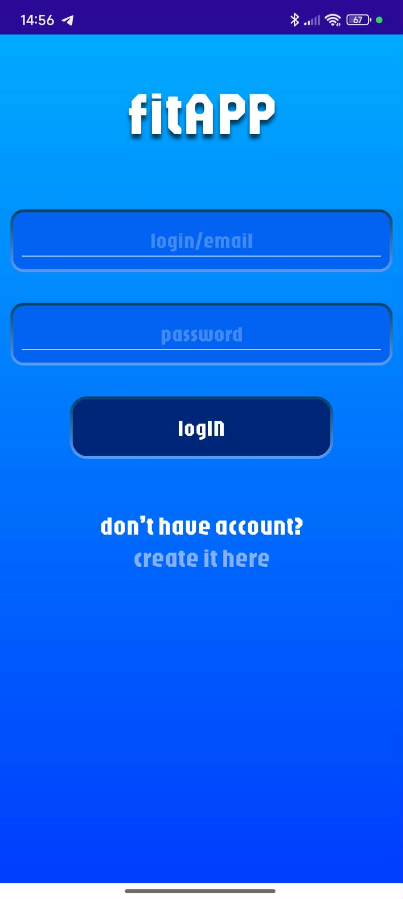
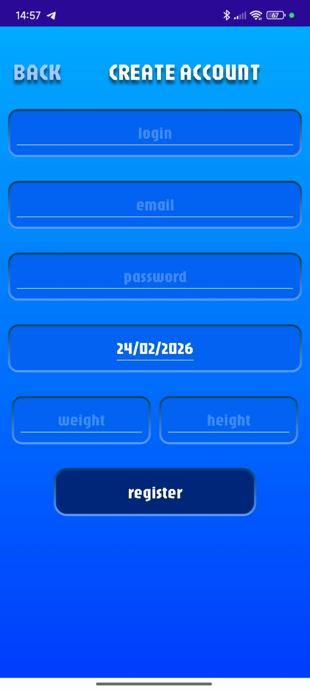
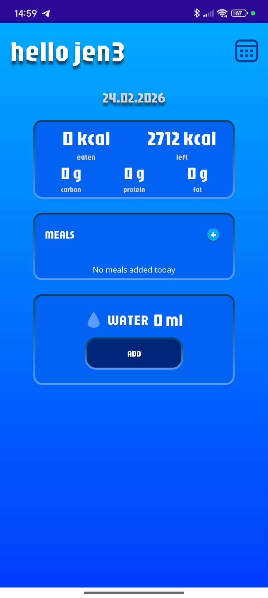
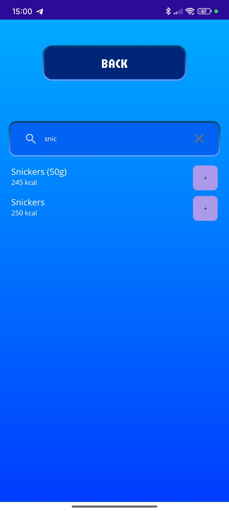
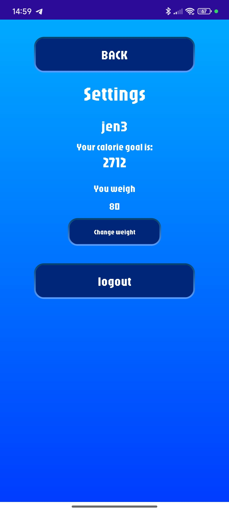
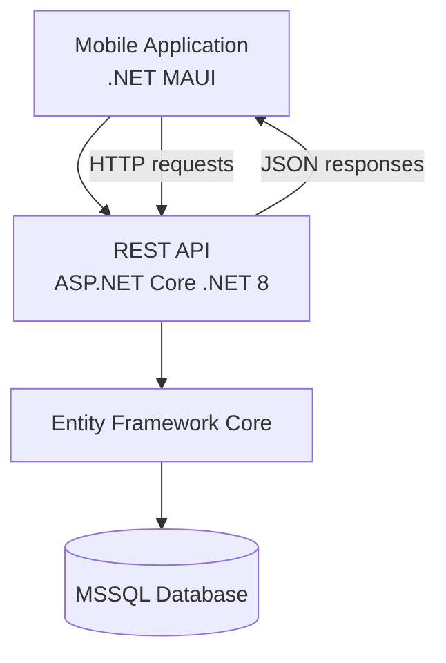

# 📱 FitApp Mobile Application 📱

Mobile fitness tracking application built with **.NET MAUI**.

The application connects to a REST API backend and allows users to monitor calories, macronutrients and hydration.

---

# 🚀 Features

- user registration
- user login
- daily calorie tracking
- meal tracking
- macronutrient calculation
- hydration tracking
- browsing historical daily reports
- updating body weight

---

# 🛠 Tech stack

<p>

</p>

- C#
- .NET 8
- .NET MAUI
- Visual Studio
- Git / GitHub

---

# 📱 Application Screenshots
<div align="center">
  
|  |  |  |
|---|---|---|
|  |  |  |
| <p align="center">Login page</p> | <p align="center">Register page</p> | <p align="center">Main page</p> |

|  |  |
|---|---|
|  |  |
| <p align="center">Add meal page</p> | <p align="center">Settings page</p> |

</div>

---

# ⚙️ Running the application

The application originally connected to a cloud-hosted API deployed on Azure.

Since the Azure environment is currently disabled, the application must be run **with a locally hosted API**.

### Steps

1. Start the FitApp API locally.
2. Update API base URL inside the application.
Example:
```
https://localhost:5001/api
```
3. Run the application using Visual Studio or the .NET CLI.
Supported platforms:
- Android
- Windows (optional)

---

# 📊 Project purpose

This application was developed as part of an engineering thesis project to demonstrate:

- mobile application development with .NET MAUI
- REST API integration
- database-driven application architecture

# 🧱 Architecture


